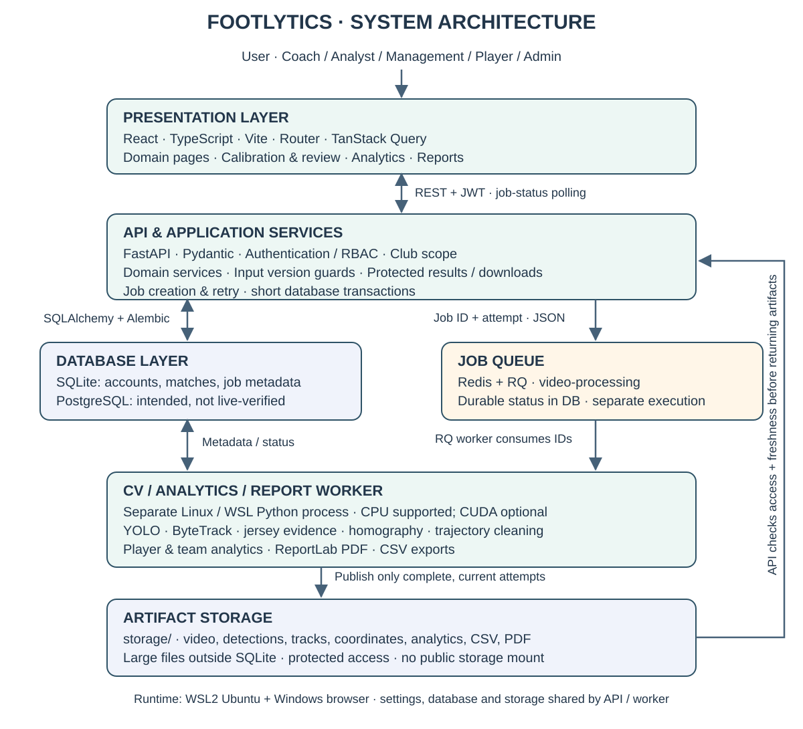
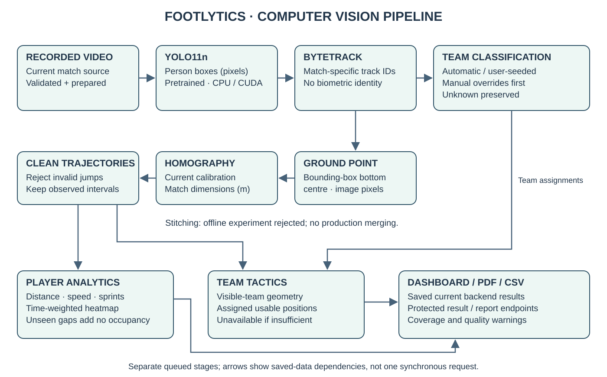

# FOOTLYTICS architecture

The final core is Phases 1–15 plus Phase 18 integration. Phases 16 and 17 are
**OPTIONAL / DEFERRED**. Empty placeholder modules for future ball/events are not
implemented features. The validated runtime is a WSL2 Ubuntu CPU backend and
worker, SQLite, Redis/RQ and a React browser application. PostgreSQL portability
is an architectural intention; a live PostgreSQL deployment has not been verified.

## Layered system architecture

[Open the scalable system diagram](architecture.svg). The SVG has a white
background and vector text for A4 reports and presentation slides. Database,
queue, worker and protected artifact storage are distinct components.

## Computer vision pipeline

[Open the separate pipeline diagram](cv-pipeline.svg). Team assignment and physical
coordinate processing are parallel dependencies; team tactics use both.

The graph shows dependencies, not one synchronous HTTP call. Each long stage has
its own durable `ProcessingJob`, queue submission, progress and attempt. Uploads
perform bounded validation and decode a real frame; they do not analyze a match.
The API returns a job ID, the frontend polls, and the worker opens its own database
session. Redis failure never triggers synchronous processing. The official worker
entry is `python scripts/run_worker.py`; API and worker share root settings,
queue name, JSON serializer, database and storage. CPU support is mandatory;
`DEVICE=auto` falls back to CPU when CUDA is unavailable.

## Storage and publication

SQLite stores domain metadata, calibration, current video identity, small result
summaries and internal relative paths. Videos, frame-derived artifacts, detection
and track CSVs, coordinate/trajectory/analytics bundles and PDFs live under
`storage/`. The storage tree is not a public static mount. Authenticated endpoints
recheck access and freshness; public DTOs omit filesystem locations.

Workers write to unique job/attempt paths and publish only complete output.
A retry advances the attempt and rejects stale/duplicate deliveries. Failure
cleans incomplete output and preserves earlier successful artifacts. Replaced
videos remain for history while one active video is enforced by the database.
Database and associated storage should be backed up together.

Evaluation lives separately in `app/evaluation`, `data/` and `storage/evaluation/`.
It does not add production tables or feed benchmark ground truth into normal
processing. The retained Phase 15 results are independent of the Phase 18 smoke.

## Current and stale results

A current result matches the active video and the exact relevant upstream input
versions. Snapshot checks run both before processing and before publication;
protected readers check current versions and artifact integrity again.

| Input change | Consequence under the existing contracts |
| --- | --- |
| Active video replaced | Old calibration and all dependent results become stale. Recalibrate and run the needed stages. |
| Calibration changed or pitch dimensions changed | Detection/tracking also depend on calibration snapshots for ROI provenance; coordinate mapping, cleaning and analytics/reports become stale. |
| Detection artifact changed | Tracking and its dependent classification, coordinates, trajectories and analytics become stale. |
| Tracking result changed | Team assignments/classification and position-based downstream outputs require the new tracking version. |
| Effective team assignment changed | Team tactics and reports depending on it become stale; physical player analytics stay current. |
| Automatic label changes while masked by a manual override | No effective-team change, so no unnecessary tactical invalidation. |
| Report dependencies or relevant match metadata changed | A previously published PDF is historical; regenerate for current results. |

Unknown is an explicit team label. Manual overrides determine the effective label;
clearing one restores the classifier result (automatic or user-seeded). Exact effective assignment fingerprints
are compared, so restoring the same effective map can restore currentness.
Stage completion is not a claim that downstream stages or scientific accuracy
are available. Missing/invalid inputs produce clear errors or Unavailable states.

## Metric definitions and assumptions

Every match owns pitch length and width in metres: **X = length, Y = width**.
The player ground estimate is `((x1 + x2) / 2, y2)`, the box bottom centre.
Homography requires at least four valid correspondences and a static planar view.
Mapped out-of-pitch points are flagged/rejected according to existing quality
rules, not clamped to create plausible positions. Broadcast pans/zooms can make
a static calibration invalid; independent coordinate accuracy is unverified.

Physical analytics consume Phase 10 usable cleaned trajectories. Consecutive
observations must belong to the same track/segment with a valid positive time
interval. Distance sums Euclidean steps; active duration sums those intervals;
average speed is total distance / active duration and remains null without time.
Sprint events combine consecutive intervals at or above the configured threshold
(default 7 m/s) and must meet the configured duration (default 1 second). Gaps do
not create movement or duration. Heatmaps accumulate interval time in the starting
position's backend bin; the browser displays the produced cells and units.

Tactics group usable positions by frame and effective team, excluding Unknown.
Centroid is mean X/Y; width is Y range and depth is X range. Compactness is mean
Euclidean distance to the team's centroid. Spacing is mean pairwise distance.
Bounding area is width × depth; convex hull area requires sufficient non-collinear
geometry. Insufficient groups retain null geometry. Summary metrics average valid
snapshots, with separate availability counts for optional metrics. No attacking
direction, tactical quality, possession or events are inferred.

The frontend sorts/formats backend results and visualizes supplied metric values;
it does not recompute distance, speed or tactical geometry. Reports consume the
same saved current results, bound heatmap count, label unavailable sections and
escape formula-like CSV text without corrupting signed numeric values.

## Access and sessions

Admin has global access. Coach/Analyst capabilities remain constrained by club
membership; roster editing is Admin/Coach, while scoped match processing also
allows Analyst. Club Management can read the implemented staff results and
protected exports but cannot start processing or change calibration/assignments.
Player accounts see permitted football-domain records, not arbitrary CV track
analytics or job administration. A football Player record is not a CV identity.

All resource checks are enforced in the backend through the existing auth and
club-scope services. Frontend role guards only improve navigation. Bearer tokens
use `sessionStorage`: same-tab reload restores a session, logout clears token and
query data, and an expired/invalid token returns the browser to authentication.
Create the first administrator with the secure CLI after applying migrations;
there is no default password. Public `/api/auth/signup` submissions are stored
as pending `signup_requests`, separate from login accounts. Only an active admin
can approve or reject them. Signup requires Coach, Analyst, Player or Club
Management; Admin is rejected by both public signup and approval. Legacy requests
with no requested role require an explicit non-admin choice. Approval atomically creates a normal User with the
requested non-admin role and optional club membership; rejection grants no access.
Reviews are serialized and recorded, and request credentials are cleared after
review. The existing password, token and club-scope services remain authoritative.
Email verification/notifications are not implemented.

## Post-core hardening

Preparation is scoped to the active video. The shared match-row lock prevents
queued/running duplicates, and a successful current preparation is reused without
enqueueing another job. Failed jobs keep the existing retry/attempt mechanism;
replacing the video resets current preparation without deleting history.

ByteTrack advances once per sampled frame, including empty frames. `TRACK_BUFFER`
counts source frames: the installed Ultralytics tracker (8.4.166-8.4.170) has no
frame-rate argument, so the wrapper passes `max(1, TRACK_BUFFER // stride)` updates.
Lost tracks keep the same span of source frames at any stride (30 frames are 1.2 s
at 25 FPS); stride 1 is unchanged. Full-frame detection is already the default
(`DETECTION_FRAME_STRIDE=1`).

Heatmap and player-detail responses add observed coverage relative to the source
video duration. Under 15 seconds is labelled a short fragment; under 20% is labelled
low coverage. These display cautions are not accuracy scores. Missing/inconsistent
duration yields unavailable coverage. Occupancy and gap rules remain unchanged.

New classification summaries include crop rejection counts, sample sufficiency,
evidence-quality failures and color separation. Legacy summaries remain readable.
See [the controlled hardening evaluation](HARDENING.md) for measured limits.

Team-color examples are bounded protected frame reads. The backend measures CIE
Lab torso features itself; clients submit only track/frame/team references and an
opaque tracking version. Prototype sets keep history. Classification jobs capture
that set at enqueue/retry, check it before processing/publication, and publish
sample counts, margins and rejection reasons without storage paths. New valid-crop
budgets are spread across a track's lifetime; at least three consistent actual
samples are required. Confident evidence for both teams keeps the track Unknown.
Saving colors alone does not rewrite existing assignments; queued classification
must complete, and effective-team changes invalidate dependent tactics/reports.

Stitching is an offline evaluator only. Its conservative experiment accepted zero
merges, so production ByteTrack IDs and heatmap grouping are unchanged. No occupancy
is interpolated between fragments. The software diagram shows execution/storage
boundaries; the CV diagram shows data dependencies and is a separate artifact.
